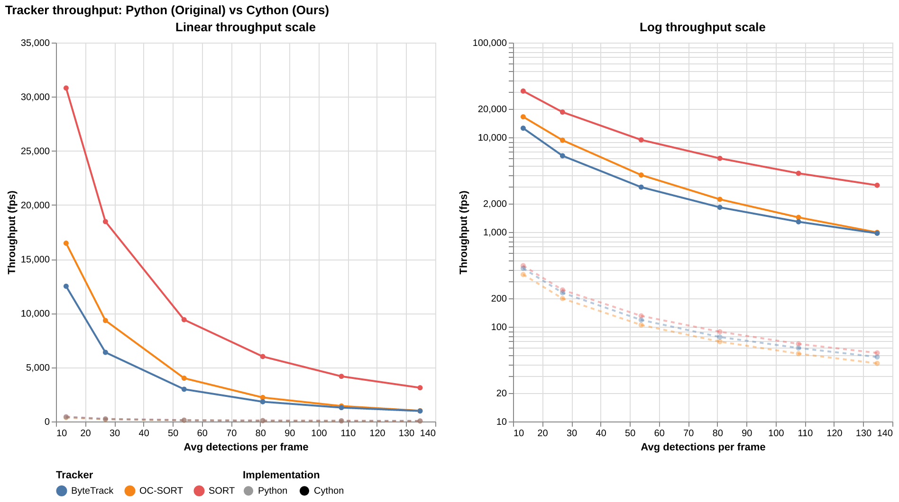
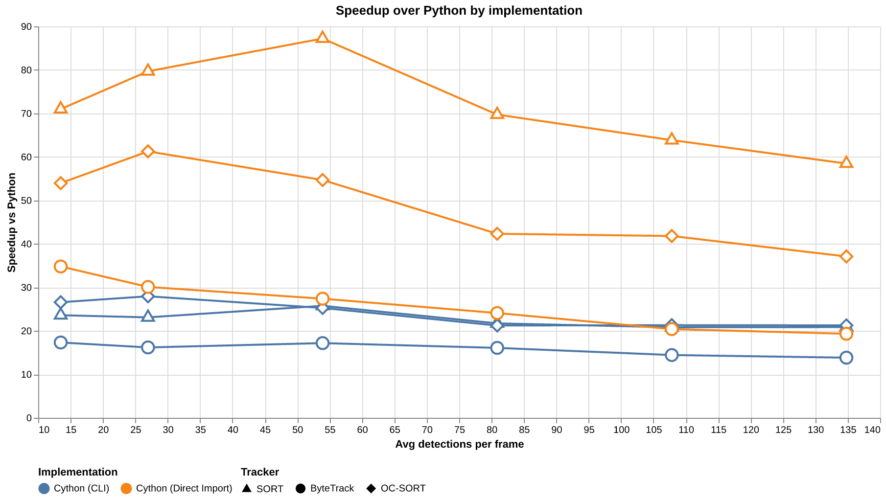

# PyxTrackers

High-performance Cython implementations of state-of-the-art multi-object tracking algorithms.

PyxTrackers provides drop-in replacements for three widely used MOT trackers, reimplemented in Cython for significant speedups while maintaining numerical equivalence with the original Python implementations.

## Supported Trackers

| Tracker | Our Speedup | Description | Paper | GitHub |
|---------|-------------|-------------|-------|--------|
| **SORT** | **70x** | Simple Online and Realtime Tracking | [Bewley et al., 2016](https://arxiv.org/abs/1602.00763) | [abewley/sort](https://github.com/abewley/sort) |
| **ByteTrack** | **45x** | Multi-Object Tracking by Associating Every Detection Box | [Zhang et al., 2022](https://arxiv.org/abs/2110.06864) | [FoundationVision/ByteTrack](https://github.com/FoundationVision/ByteTrack) |
| **OC-SORT** | **30x** | Observation-Centric SORT | [Cao et al., 2023](https://arxiv.org/abs/2203.14360) | [noahcao/OC_SORT](https://github.com/noahcao/OC_SORT) |

## Performance

The plots below were generated by running `uv run pytest --visualize`, which benchmarks all three trackers across a range of detection counts and records throughput (frames per second) for both the Python reference and Cython implementations.


**Throughput** — frames processed per second as average detections per frame increases. Dashed lines are the original Python implementations; solid lines are the Cython reimplementations. The log-scale panel makes the lower-throughput region easier to read.


**Speedup** — ratio of Python time to Cython time (higher = faster).

## Installation

### From source (with uv, recommended)

```bash
git clone https://github.com/chanwutk/pyxtrackers.git
cd pyxtrackers
uv sync
uv run python setup.py build_ext
```

### From source (with pip)

```bash
git clone https://github.com/chanwutk/pyxtrackers.git
cd pyxtrackers
pip install -e .
```

### Requirements

- Python >= 3.10
- NumPy >= 2.0
- A C/C++ compiler (gcc, clang, or MSVC)
- Cython >= 3.0 (build-time only)

## Quick Start

```python
import numpy as np
from pyxtrackers import Sort, BYTETracker, OCSort

# --- SORT ---
tracker = Sort(max_age=30, min_hits=3, iou_threshold=0.3)

# Detections: [[x1, y1, x2, y2, score], ...]
detections = np.array([
    [100, 100, 200, 200, 0.9],
    [300, 300, 400, 400, 0.8],
], dtype=np.float64)

# Returns: [[x1, y1, x2, y2, track_id], ...]
tracked = tracker.update(detections)

# --- ByteTrack ---
tracker = BYTETracker(track_thresh=0.5, match_thresh=0.8, track_buffer=30)
tracked = tracker.update(detections)
# Returns: [[x1, y1, x2, y2, track_id], ...]

# --- OC-SORT ---
tracker = OCSort(det_thresh=0.3)
tracked = tracker.update(detections)
# Returns: [[x1, y1, x2, y2, track_id], ...]
```

All three trackers share the same interface: configuration in the constructor, only detections in `update()`.

If the input detections were produced at a different resolution than the original image, pass `img_info` and `img_size` to the constructor to enable automatic rescaling:

```python
tracker = BYTETracker(track_thresh=0.5, img_info=(1080, 1920), img_size=(608, 1088))
tracker = OCSort(det_thresh=0.3, img_info=(1080, 1920), img_size=(608, 1088))
```

## How It Works

Each tracker is reimplemented in Cython using:

- **C structs** instead of Python classes for track state (zero Python object overhead)
- **Flat arrays** for matrices (e.g., `double[64]` for 8x8 covariance) for cache-friendly layout
- **`nogil` sections** for GIL-free computation in hot paths
- **`cdef` functions** for C-only internal calls with no Python dispatch overhead
- **Vendored LAPJV** C++ solver for linear assignment (no external dependency)

Kalman filter predict/update cycles, IOU computation, and the Hungarian algorithm all run at C speed.

## Project Structure

```
pyxtrackers/           # Installable Cython package
  sort/                # SORT tracker (7D Kalman, constant velocity)
  bytetrack/           # ByteTrack tracker (8D Kalman, two-stage association)
  ocsort/              # OC-SORT tracker (7D Kalman, freeze/unfreeze)
  cli.py               # stdin/stdout CLI for cross-language interop
references/            # Pure Python reference implementations (for testing)
tests/                 # Comparison tests verifying numerical equivalence
vendor/lapjv/          # Vendored C++ linear assignment solver
```

## Development

```bash
# Setup
uv sync
uv run python setup.py build_ext

# Run tests
uv run pytest tests/ -v

# Rebuild after changing .pyx files
uv run python setup.py build_ext

# Clean build artifacts
uv run python setup.py clean
```

## Testing

Tests run both the Cython and Python reference implementations on identical detection sequences and verify numerical equivalence within 1e-6 pixel tolerance.

```bash
uv run pytest
```

## Interoperability (CLI)

PyxTrackers includes a stdin/stdout CLI that lets any language invoke tracking via pipes. After installation, the `pyxtrackers` command is available.

### Usage

```bash
pyxtrackers <tracker> [options]
```

The process reads one line per frame from stdin, runs the tracker, and writes one line per frame to stdout. Empty input lines (no detections) still advance the tracker state and produce an empty output line, preserving 1:1 line correspondence.

### Input format

Detections are space-separated, each with 5 comma-separated values:

```
x1,y1,x2,y2,score x1,y1,x2,y2,score ...
```

### Output format

Tracked objects are space-separated, each with 5 comma-separated values:

```
id,x1,y1,x2,y2 id,x1,y1,x2,y2 ...
```

### Examples

Pipe detections from a file:

```bash
cat detections.txt | pyxtrackers sort --min-hits 1 > tracks.txt
```

Inline:

```bash
echo "100,200,300,400,0.9 150,250,350,450,0.8" | pyxtrackers sort --min-hits 1
```

With ByteTrack and image scaling:

```bash
cat detections.txt | pyxtrackers bytetrack --track-thresh 0.5 --img-info 1080 1920 --img-size 608 1088
```

### Cross-language integration

Any language that can spawn a subprocess and read/write its stdin/stdout can use pyxtrackers. For example, in Node.js:

```javascript
const { spawn } = require('child_process');
const tracker = spawn('pyxtrackers', ['sort', '--min-hits', '1']);

tracker.stdout.on('data', (data) => {
  // Each line: "id,x1,y1,x2,y2 id,x1,y1,x2,y2 ..."
  console.log('Tracks:', data.toString().trim());
});

// Send detections (one frame per line)
tracker.stdin.write('100,200,300,400,0.9 150,250,350,450,0.8\n');
tracker.stdin.write('105,205,305,405,0.9\n');
tracker.stdin.end();
```

Or in Rust (pseudocode):

```rust
use std::process::{Command, Stdio};
use std::io::{Write, BufRead, BufReader};

let mut child = Command::new("pyxtrackers")
    .args(&["ocsort", "--det-thresh", "0.3"])
    .stdin(Stdio::piped())
    .stdout(Stdio::piped())
    .spawn()?;

let stdin = child.stdin.as_mut().unwrap();
writeln!(stdin, "100,200,300,400,0.9")?;

let reader = BufReader::new(child.stdout.take().unwrap());
for line in reader.lines() {
    println!("Tracks: {}", line?);
}
```

## Roadmap

- [ ] Add GitHub Actions CI to test across environments (pyenv, uv, conda, poetry).
- [ ] Make this package available in PyPI and possibly conda. Consideration: we should pre-build the binary; based on whether the users have their own C compiler, we may distribute the prebuit version.

## License

MIT
